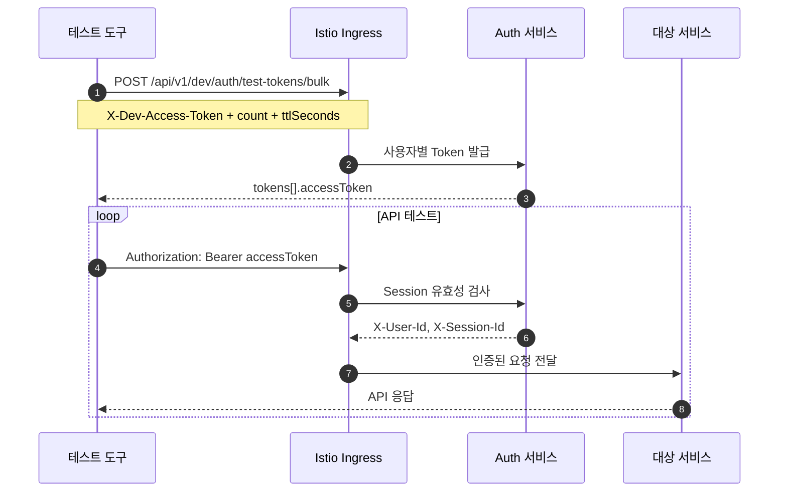

# AGENTS.md

이 파일은 `gitops` repo에서 빠르게 위치와 Taskfile 진입점을 찾기 위한 얕은 인덱스다. 세부 운영 절차는 각 폴더의 README와 Taskfile을 우선 확인한다.

## Root structure

- `argo/`: Argo CD Application entrypoint.
- `charts/`: 공통 Helm chart.
- `cluster/`: 클러스터 bootstrap, 실험, reference 리소스.
- `docs/`: GitOps 운영 문서와 ADR.
- `platform/`: namespace, data, Kong, monitoring, observability, policies, storage 같은 플랫폼 리소스.
- `values/`: 서비스/환경/scenario별 Helm values.
- `archive/`: 현재 운영 경로가 아닌 과거 reference.

## Taskfile index

- `Taskfile.yml`: repo 루트 작업 진입점. 전체 검증, 로컬 dev, platform render, scenario render, 서비스 Helm render를 여기서 확인한다.
- `platform/monitoring/Taskfile.yml`: Prometheus/Grafana monitoring stack render/up/status/down.
- `platform/observability/Taskfile.yml`: Tempo/Loki/Collector observability stack render/up/status/down.

## Usage

- 먼저 `task --list`로 현재 repo의 사용 가능한 작업을 확인한다.
- 플랫폼 단위 검증은 `task platform:render`를 우선 사용한다.
- 전체 검증이 필요할 때만 `task validate`를 사용한다.
- 하위 Taskfile은 `task --taskfile <path> <task>` 형식으로 실행한다.
- 기존 사용자 변경이 있는 worktree에서는 요청받은 범위 밖의 파일을 되돌리거나 함께 커밋하지 않는다.

## Development test authentication

- 개발환경 API 테스트에서는 회원가입, 로그인, OTP 인증 대신 Auth 서비스의 `POST /api/v1/dev/auth/test-tokens/bulk`를 사용한다.
- `X-Dev-Access-Token`과 `count`를 전달하고, 응답의 `tokens[].accessToken`을 `Authorization: Bearer <token>`으로 사용한다. `count`는 최대 10,000이며 `ttlSeconds` 기본값은 86,400초다.
- 실제 Ingress 호출 예제와 테스트 코드는 `platform/istio/tests/e2e/`에서 확인한다.
- 요청과 응답의 자세한 계약은 `archive` repo의 `../archive/blueprint/50-service-design/A_300_auth/A_300_40-api/openapi/paths/API_A_300_34_issue_development_bulk_tokens.yaml`을 확인한다.
- 이 API는 Auth 사용자와 Session만 생성한다. 대상 서비스의 프로필이나 권한 데이터가 필요하면 별도 fixture를 준비한다.

